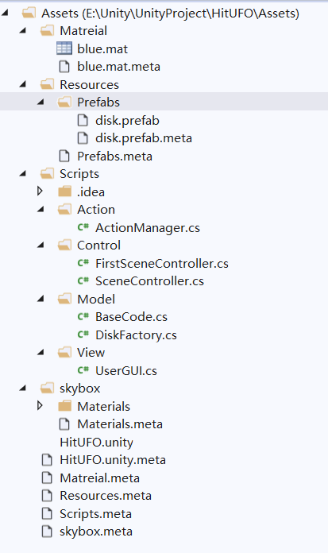
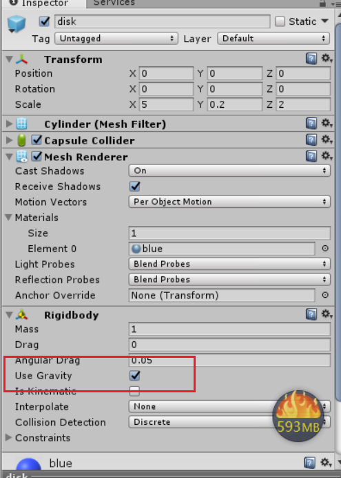

#### 演示视频：

<https://www.bilibili.com/video/av70593421>

#### 设计说明：

总体结构：



首先设计好一个飞碟预制，确定其大小属性和颜色（颜色也可不选，之后程序会生成），并且增加physcis中的Rigidbody组件，勾选Use Gravity（使得物体的运动受重力影响）：



编写BaseCode.cs，其中包含Director类，还有一个储存飞碟属性的类Disk，外加一个场景控制器的接口IScenController


DiskFactory.cs以工厂模式管理飞碟的生产与回收。他会根据回合数生成不同速度和大小的飞碟并设定随机初始位置和初始速度以及在六种颜色中随机选择一种

```go
using System.Collections;
using System.Collections.Generic;
using UnityEngine;
using PriestsAndDevils;
// 工厂模式
public class DiskFactory : MonoBehaviour
{
    private List<Disk> toDelete = new List<Disk>();
    private List<Disk> toUse = new List<Disk>();
    public Color[] colors = {Color.white,Color.yellow,Color.red,Color.blue,Color.green,Color.black};//可选颜色
    public GameObject GetDisk(int round){//根据回合数对飞碟设置属性并返回
        GameObject newDisk = null;
        if (toUse.Count > 0){
            newDisk = toUse[0].gameObject;
            toUse.Remove(toUse[0]);
        }else{
            newDisk = GameObject.Instantiate<GameObject>(Resources.Load<GameObject>("Prefabs/disk"), Vector3.zero, Quaternion.identity);
            newDisk.AddComponent<Disk>();
        }
        // 飞碟的速度为round*7
        newDisk.GetComponent<Disk>().speed = 7.0f * round;
        // 飞碟随round越来越小
        newDisk.GetComponent<Disk>().size = (1 - round*0.1f);
        // 飞碟颜色随机
        int color = UnityEngine.Random.Range(0, 6);//共有六种颜色
        newDisk.GetComponent<Disk>().color = colors[color];
       
        // 飞碟的发射方向
        float RanX = UnityEngine.Random.Range(-1, 3) < 1 ? -1 : 1;//-1，0则为负方向，1，2则为正方向
        newDisk.GetComponent<Disk>().direction = new Vector3(-RanX, UnityEngine.Random.Range(-2f, 2f), 0);
        // 飞碟的初始位置
        newDisk.GetComponent<Disk>().position = new Vector3(RanX*13, UnityEngine.Random.Range(-2f, 2f), UnityEngine.Random.Range(-1f, 1f));

        toDelete.Add(newDisk.GetComponent<Disk>());
        newDisk.SetActive(false);
        newDisk.name = newDisk.GetInstanceID().ToString();
        return newDisk;
    }

    public void FreeDisk(GameObject disk){
        Disk cycledDisk = null;
        foreach (Disk toCycle in toDelete){
            if (disk.GetInstanceID() == toCycle.gameObject.GetInstanceID()){
                cycledDisk = toCycle;
            }
        }
        if (cycledDisk != null){
            cycledDisk.gameObject.SetActive(false);
            toUse.Add(cycledDisk);
            toDelete.Remove(cycledDisk);
        }
    }

}
```

ActionManager.cs管理场景的动作：管理飞碟的运动以及与用户交互：每当有光标拾取到飞碟时，分数加一，飞碟消失。

```go
using System.Collections;
using System.Collections.Generic;
using UnityEngine;
using PriestsAndDevils;

public class ActionManager : MonoBehaviour
{

    public Vector3 direction;//运动方向
    public float speed;//初速度
    public GameObject cam;

    public void diskFly(Vector3 direction,float speed){//赋予飞碟初速度和方向
        this.direction = direction;
        this.speed = speed;
    }

    // Start is called before the first frame update
    void Start(){
        cam = GameObject.Find("Main Camera");
    }

    // Update is called once per frame
    void Update(){
        
        this.gameObject.transform.position += speed * direction * Time.deltaTime;

        if (Input.GetButtonDown("Fire1")){   //光标拾取物体的结果，即鼠标集中飞碟的结果
           
            Debug.Log("Fired Pressed");
            Debug.Log(Input.mousePosition);

            Vector3 mp = Input.mousePosition; //get Screen Position

            //create ray, origin is camera, and direction to mousepoint
            Camera ca;
            if (cam != null) ca = cam.GetComponent<Camera>();
            else ca = Camera.main;

            Ray ray = ca.ScreenPointToRay(Input.mousePosition);

            //Return the ray's hits
            RaycastHit[] hits = Physics.RaycastAll(ray);

            foreach (RaycastHit hit in hits){
                print(hit.transform.gameObject.name);
                if (hit.collider.gameObject.tag.Contains("Finish")){ //plane tag
                    Debug.Log("hit " + hit.collider.gameObject.name + "!");
                }
                Singleton<DiskFactory>.Instance.FreeDisk(hit.transform.gameObject);//飞碟消失
                //this.gameObject.GetComponent<UserGUI>().score ++;
                //SceneController.getInstance().addScore();
                Director.getInstance ().currentSceneController.getSceneController().addScore();//分数加一
            }
        }

    }
}
```

SceneController.cs作为场景控制器控制游戏的输出信息：回合数，总飞碟数，所得分数

```go
public class SceneController{
    
    public int round ;  //回合数
    public int total ;  //总飞碟数
    public int score ;//得到的分数

    private static SceneController sceneCtrl;

    public SceneController() {//用于SceneController归0
        score = 0;
        total = 0;
        score = 0;
    }
    public static SceneController getInstance(){
        if (sceneCtrl == null){
            sceneCtrl = new SceneController();
        }
        return sceneCtrl;
    }

    public void addRound(){
        round++;
    }
    public void addTotal(){
        total++;
    }
    public void addScore(){
        score++;
    }
    
    public int getRound(){
        return round;
    }
    public int getTotal() {
        return total;
    }
    public int getScore() {
        return score;
    }
}
```


FirstSceneController.cs作为第一场景控制器，负责控制游戏场景的加载和切换。

```go
using System.Collections;
using System.Collections.Generic;
using UnityEngine;
using PriestsAndDevils;


public class Singleton<T> : MonoBehaviour where T : MonoBehaviour
{
    protected static T instance;
    public static T Instance
    {
        get
        {
            if (instance == null)
            {
                instance = (T)FindObjectOfType(typeof(T));
                if (instance == null) {  
                    Debug.LogError ("An instance of " + typeof(T) +
                    " is needed in the scene, but there is none.");  
                }  
            }
            return instance;
        }
    }
}


public class FirstSceneController : MonoBehaviour, ISceneController{
    public int diskFlyTimes; //已经发射的飞碟个数，每回合10个，最多30个
    public float time;// 时间，用于控制飞碟发射间隔
    public int round;  // 当前回合数
    // 飞碟队列
    public Queue<GameObject> diskQueue = new Queue<GameObject>();//飞碟队列
    public SceneController  sceneCtrl;

    // Start is called before the first frame update
    void Start(){
        // 当前场景控制器
        Director.getInstance().currentSceneController = this;
        this.gameObject.AddComponent<DiskFactory>();
        this.gameObject.AddComponent<UserGUI>();
        Director.getInstance().currentSceneController.Init();//初始化FirstSceneController相关数据
    }

    // 初始化每个回合的飞碟队列,每个回合的飞碟属性不同
    void initQueue(){
        for(int i = 0;i < 10;i ++)
            diskQueue.Enqueue(Singleton<DiskFactory>.Instance.GetDisk(round));
    }

    // Update is called once per frame
    void Update() {
       // round = sceneCtrl.getRound();
        time += Time.deltaTime;
        // 发射飞碟的间隔回合数成反比
        if(time >= 2.0f-0.3*round){

            if(diskFlyTimes >= 30){//游戏结束
                Reset();
            }else if ((diskFlyTimes % 10) == 0 ){//更新回合（此步骤必须在发射飞碟前面）
                round ++;//在initQueue();前面才行
                sceneCtrl.addRound();//回合数增加
                initQueue();//初始化新的飞盘队列
            }
            if (diskFlyTimes < 30){
                time = 0;
                ThrowDisk();//发射飞盘
                diskFlyTimes ++;//飞盘数增加
                sceneCtrl.addTotal();//综费盘数增加
            }
        }
    }

    public void ThrowDisk()
    {
        if(diskQueue.Count > 0)
        {
            GameObject disk = diskQueue.Dequeue();
            disk.GetComponent<Renderer>().material.color = disk.GetComponent<Disk>().color;
            disk.transform.position = disk.GetComponent<Disk>().position;
            disk.transform.localScale = disk.GetComponent<Disk>().size * disk.transform.localScale;
            disk.SetActive(true);
            disk.AddComponent<ActionManager>();
            disk.GetComponent<ActionManager>().diskFly(disk.GetComponent<Disk>().direction, disk.GetComponent<Disk>().speed);
        }
    }
    /*public int getRound(){
        return sceneCtrl.getRound();
    }
    public int getTotal(){
        return sceneCtrl.getTotal();
    }*/

    public void Init()
    {
        sceneCtrl = new SceneController();//SceneController元素归0
        diskFlyTimes = 0;
        time = 0;
        round = 0;
        diskQueue.Clear();//清空飞盘队列
    }
    public SceneController  getSceneController(){//返回SceneController
        return sceneCtrl;
    }
    void Reset()
    {//游戏重置
        this.gameObject.GetComponent<UserGUI>().reset = 1;
    }

}
```

UserGUI.cs负责输出提示信息，包括回合数Round，未击中飞碟数Miss,分数Score,以及在游戏结束时输出重新开始的按钮

```go
using System.Collections;
using System.Collections.Generic;
using UnityEngine;
using PriestsAndDevils;

public class UserGUI : MonoBehaviour
{
    /*public int round;//直接在此定义使用时旧的数字不会消失
    public int total;
    public int score;*/
    public int reset;
    GUIStyle style;
	GUIStyle buttonStyle;
   // public ISceneController userAction;直接用可以运行，但是会报错
    // Start is called before the first frame update
    void Start()
    {
        /*round = 0;
        total = 0;
        score = 0;*/
        reset = 0;
        style = new GUIStyle();
		style.fontSize = 30;
		//style.alignment = TextAnchor.MiddleCenter;
		style.normal.textColor = Color.green;// 

		buttonStyle = new GUIStyle("button");
		buttonStyle.fontSize = 30;
		buttonStyle.normal.textColor = Color.green;// 
        //userAction = Director.getInstance().currentSceneController;//此处挂载失败
    }

    // Update is called once per frame
    void Update()
    {
       /*round = userAction.getSceneController().getRound();
        total = userAction.getSceneController().getTotal();
        score = userAction.getSceneController().getScore();*/
    }

    private void OnGUI()
    {
        if(reset == 1){
            if(GUI.Button(new Rect(380, 250, 100, 80), "Reset",buttonStyle)){
            	//userAction.Init();
                Director.getInstance().currentSceneController.Init();
                reset = 0;
            }
        }

        int round = Director.getInstance().currentSceneController.getSceneController().getRound();
        int total = Director.getInstance().currentSceneController.getSceneController().getTotal();
        int score = Director.getInstance().currentSceneController.getSceneController().getScore();
        int miss = total - score;//未击中的飞碟数
        //string text = "Round: " + userAction.getSceneController().GetRound().ToString() + "\nTotal:  " + total.ToString() + "\nScores:  " + score.ToString();
        string text = "Round: " + round.ToString() + "\nMiss:  " + miss.ToString() + "\nScores:  " + score.ToString();
        GUI.Label(new Rect(10, 10, Screen.width, 50),text,style);      
    }

}
```


#### 参考资料

<https://blog.csdn.net/x2_yt/article/details/66969242>